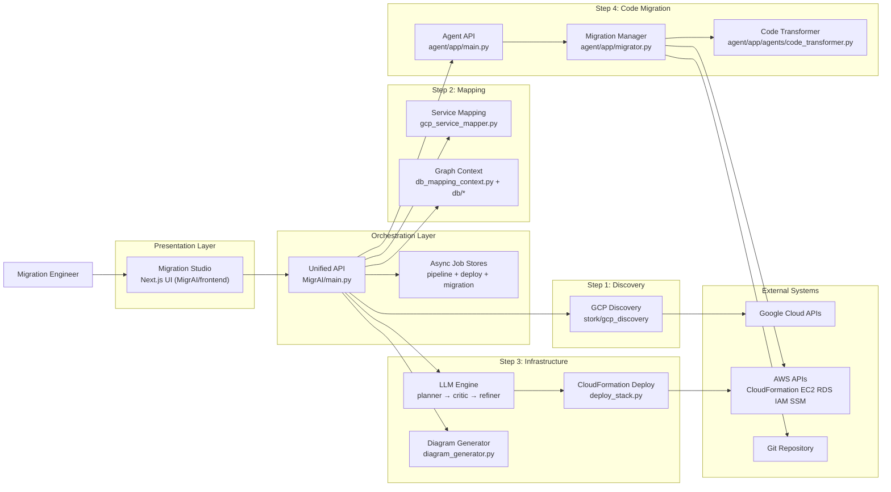
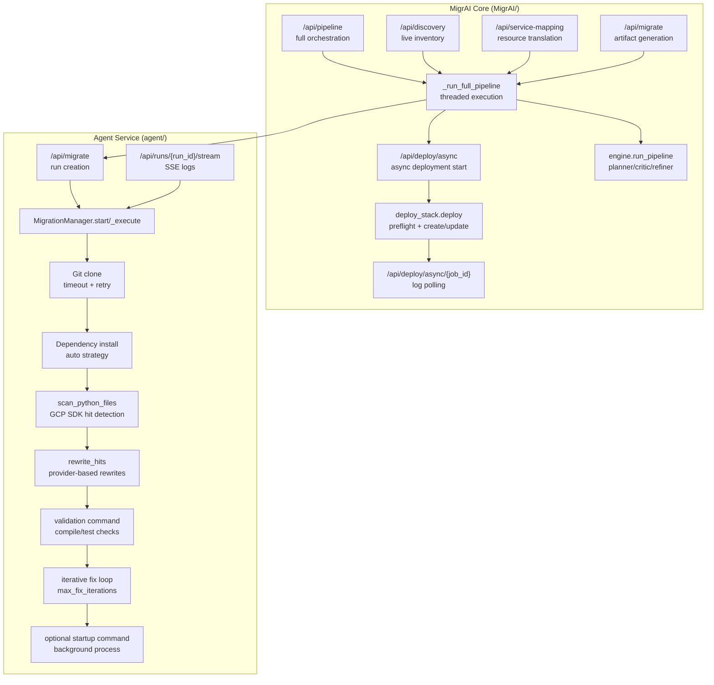
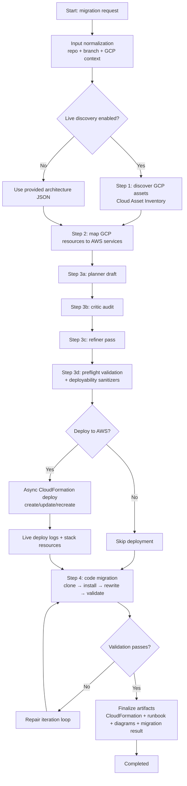

# MigrAIne

End-to-end migration platform for moving workloads from GCP to AWS.

Combines two major codebases:

- `MigrAI/` — unified pipeline orchestrator (discovery → mapping → infrastructure generation → deploy → code migration)
- `agent/` — agentic code transformation service for repository-level migration and runtime validation

---

## Table of Contents

1. [Project Scope](#1-project-scope)
2. [Repository Structure](#2-repository-structure)
3. [Technology Stack](#3-technology-stack)
4. [Overall Architecture](#4-overall-architecture)
5. [Subcomponents In Depth](#5-subcomponents-in-depth)
6. [Pipeline Flow](#6-pipeline-flow)
7. [Directory Deep Dive](#7-directory-deep-dive)
8. [API Surfaces](#8-api-surfaces)
9. [Runtime Flow and Design Rationale](#9-runtime-flow-and-design-rationale)
10. [Local Setup and Run](#10-local-setup-and-run)
11. [Output Artifacts](#11-output-artifacts)

---

## 1. Project Scope

MigrAIne answers a practical migration question: how can an engineering team discover an existing GCP footprint, map it to AWS services, generate deployable infrastructure artifacts, and migrate application code in one coordinated flow?

The platform supports two operation styles:

- **Full pipeline mode** — discovery, mapping, CloudFormation generation, deploy, and code migration
- **Focused mode** — run individual capabilities (deploy only, mapping only, or agent migration only)

---

## 2. Repository Structure

```
final/
├── agent/
│   ├── main.py
│   ├── pyproject.toml
│   └── app/
│       ├── main.py
│       ├── migrator.py
│       ├── service_map.py
│       ├── logging_bus.py
│       ├── models.py
│       ├── agents/
│       │   └── code_transformer.py
│       └── llm/
│           ├── base.py
│           └── providers.py
└── MigrAI/
    ├── main.py
    ├── engine.py
    ├── deploy_stack.py
    ├── gcp_service_mapper.py
    ├── diagram_generator.py
    ├── backend_api.py
    ├── frontend/
    │   ├── app/
    │   └── components/
    ├── stork/
    │   ├── main.py
    │   └── gcp_discovery/
    └── db/
```

---

## 3. Technology Stack

### Backend and Orchestration

- Python 3.x
- FastAPI — service APIs and orchestration endpoints
- boto3 / botocore — AWS interactions (CloudFormation, EC2, RDS, SSM)
- python-dotenv — runtime environment configuration
- Pydantic — request/response models

### Discovery and Mapping

- `google-cloud-asset`, `google-auth` — GCP Asset Inventory clients under `stork/`
- Rule-based and context-enhanced mapping via `gcp_service_mapper.py` and graph context in `db/`

### Infrastructure Synthesis

- LLM-driven planner/critic/refiner pipeline in `engine.py`
- Template sanitization, validation, and resilient deployment in `deploy_stack.py`
- Mermaid-compatible architecture rendering and summary generation in `diagram_generator.py`

### Agentic Code Migration

- GitPython — repository cloning
- LLM provider abstraction in `agent/app/llm/`
- Pattern scanning and targeted rewrite engine in `agent/app/agents/code_transformer.py`
- Iterative validation and repair loop in `agent/app/migrator.py`

### Frontend

- Next.js + React + TypeScript (`MigrAI/frontend/`)
- TailwindCSS + Radix UI
- Mermaid.js — architecture diagram rendering in the UI

---

## 4. Overall Architecture



---

## 5. Subcomponents In Depth



---

## 6. Pipeline Flow



---

## 7. Directory Deep Dive

### A. `MigrAI/` — Unified Orchestrator

Primary responsibility: coordinate the full migration lifecycle with one API surface and a background job model.

| Module | Responsibility |
|---|---|
| `main.py` | Top-level FastAPI app; orchestration logic for full pipeline and async deploy jobs |
| `engine.py` | LLM-driven infrastructure synthesis loop (planner/critic/refiner/runbook) |
| `deploy_stack.py` | CloudFormation sanitization, parameter fallback, preflight validation, and deploy with resource inventory |
| `gcp_service_mapper.py` | Deterministic mapping rules and context extraction for GCP → AWS translation |
| `diagram_generator.py` | Architecture and mapping diagram artifact generation |
| `stork/gcp_discovery/client.py` | Live GCP asset inventory and normalization layer |
| `frontend/` | Next.js migration studio, polling-based status views, and diagram rendering |

Operational behavior:

- Executes long-running workloads in background threads
- Publishes incremental status snapshots for real-time UI visibility
- Supports async deployment with progressive log polling and post-deploy resource listing

### B. `agent/` — Code Migration Engine

Primary responsibility: clone and transform application repositories from GCP SDK usage toward AWS-compatible patterns, then validate and optionally run the migrated app.

| Module | Responsibility |
|---|---|
| `app/main.py` | FastAPI endpoints for migration runs, status, file listing, and SSE log streaming |
| `app/migrator.py` | Run lifecycle manager — workspace setup, clone, install, rewrite, validate, startup |
| `app/agents/code_transformer.py` | Python file scan and targeted rewrite logic for known GCP usage patterns |
| `app/service_map.py` | AWS architecture YAML and service mapping generation from discovered resources |
| `app/logging_bus.py` | In-memory event bus for near-real-time progress delivery |
| `app/llm/providers.py` | LLM provider abstraction and selection |

Operational behavior:

- Creates isolated per-run workspaces under `workspaces/<run_id>/`
- Uses timeout and retry for clone/install stages to reduce pipeline stalls
- Streams migration state and detailed logs to UI or API clients

---

## 8. API Surfaces

### Unified API (`MigrAI/main.py`)

| Method | Endpoint | Description |
|---|---|---|
| `POST` | `/api/pipeline` | Start full end-to-end migration pipeline |
| `GET` | `/api/pipeline/{job_id}` | Pipeline status and partial/final results |
| `POST` | `/api/deploy/async` | Launch asynchronous CloudFormation deployment |
| `GET` | `/api/deploy/async/{job_id}` | Poll deployment logs and result payload |
| `POST` | `/api/migrate` | Infrastructure generation job |
| `POST` | `/api/diagrams` | Diagram generation from source and CloudFormation |

### Agent API (`agent/app/main.py`)

| Method | Endpoint | Description |
|---|---|---|
| `POST` | `/api/migrate` | Start repository code migration run |
| `GET` | `/api/runs/{run_id}` | Run status and metadata |
| `GET` | `/api/runs/{run_id}/logs` | Accumulated log events |
| `GET` | `/api/runs/{run_id}/stream` | SSE event stream for live updates |
| `GET` | `/api/runs/{run_id}/files` | Migrated workspace file listing |

---

## 9. Runtime Flow and Design Rationale

### Why the architecture is split

The orchestrator (`MigrAI/`) owns cross-stage workflow and cloud infrastructure outcomes. The agent (`agent/`) owns repository-centric code transformation. This separation keeps deployment and code rewrite responsibilities isolated while preserving composability.

### Why asynchronous jobs are used

Discovery, generation, deploy, and rewrite operations are all long-running. Pollable job state and streamed logs keep the frontend responsive and observable. Failure handling is localised per stage while still producing a unified final report.

### Why sanitization and preflight are central

LLM-generated templates often require deterministic correction before deployment. `deploy_stack.py` performs repeatable sanitization and preflight validation to reduce runtime deployment failures. The deployer returns stack metadata and resource inventory for immediate AWS console verification.

### Why mapping uses both rules and context

Deterministic mapping rules provide explainability and repeatability. Graph context enrichment improves mapping quality for complex resource sets. The pipeline balances strictness (known mappings) with flexibility (context and LLM refinement).

---

## 10. Local Setup and Run

### Prerequisites

- Python 3.10+ (agent requires 3.13 per `pyproject.toml`)
- Node.js 20+
- AWS credentials configured (CloudFormation, EC2, RDS, IAM, SSM)
- GCP Application Default Credentials (for live discovery)

### Option A — Run unified pipeline backend

```bash
cd MigrAI
pip install -r requirements.txt
python main.py
```

Default: `http://localhost:8000`

### Option B — Run agent service standalone

```bash
cd agent
uv sync
uv run python main.py
```

Default: `http://localhost:9000`

### Option C — Run frontend studio

```bash
cd MigrAI/frontend
npm install
npm run dev
```

Default: `http://localhost:3000`

---

## 11. Output Artifacts

| Artifact | Description |
|---|---|
| `MigrAI/output_cloudformation.yaml` | Generated and sanitized CloudFormation template |
| `MigrAI/output_runbook.md` | Migration and deployment runbook |
| Full pipeline result object | Mapped services, deployment logs, deployment result, discovered resources, and agent migration status |
| Agent run workspace (`workspaces/<run_id>/`) | Rewritten files, diffs, validation summaries, and startup logs |

---

MigrAIne is built as an observable migration system — each stage is explicit, each major transition is logged, and each output artifact is inspectable for engineering review and auditability.
